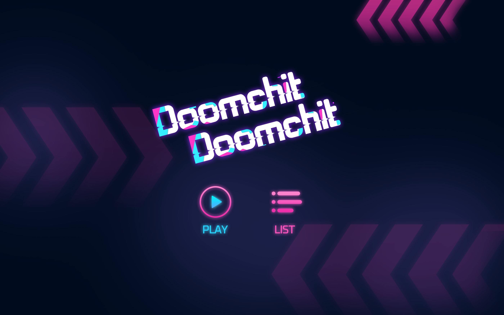
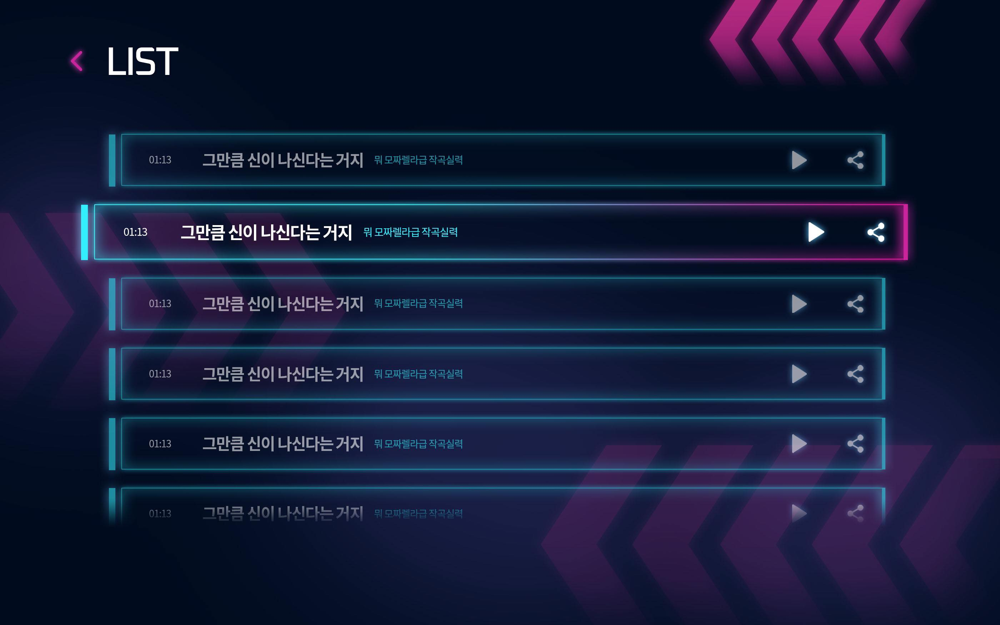
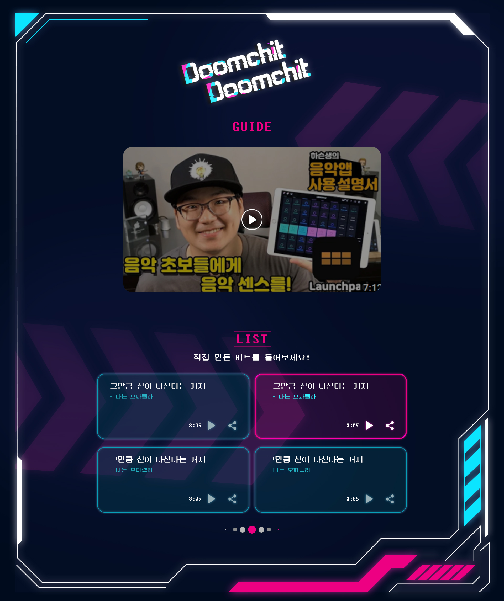

# Doomchit-Doomchit(둠칫둠칫) - 2021 Mirim IT show
런치패드를 기반한 비트메이커 !

## Outline

_이제 나도 힙합DJ! 아름다운 음악을 믹싱하고 비트를 만드세요!_

미림여자정보과학고등학교 전공동아리 앱앤미는 “User에서 Maker로”라는 신조에 맞추어 여러 프로젝트를 진행해왔습니다.   
"Doomchit-Doomchit(둠칫둠칫)"은 런치패드를 기반한 비트메이커로, 사용자가 직접 음악을 믹싱하고 비트를 만드는 앱과 녹음한 비트를 들을 수 있는 웹입니다.

## Screen

> All images used in "Doomchit-Doomchit(둠칫둠칫)" are commercially available.
>> App

[메인화면]

---------------------------------------
[녹음목록화면]

---------------------------------------
[비트제작화면]

---------------------------------------
>> Web

[메인화면]

---------------------------------------

## Additional

## Members
* **Soo-bin Lee (이수빈)** : PM, Plan, Full Stack Development - [Soo-bin](https://github.com/ccomangi2)
* **A-ra Kim (김아라)** : Full Stack Development - [A-ra](https://github.com/IknowAra)
* **Soo-yeon Maeng (맹수연)** : Full Stack Development - [Soo-yeon](https://github.com/maengsooyeon)
* **Hyung-yeon Ham (함형연)** : Full Stack Development - [Hyng-yeon](https://github.com/guddus326)
* **Yu-bin Kwon (권유빈)** : Design - [Yu-bin Kwon]()
* **Yeon-seo Oh (오연서)** : Design - [Yeon-seo Oh]()

